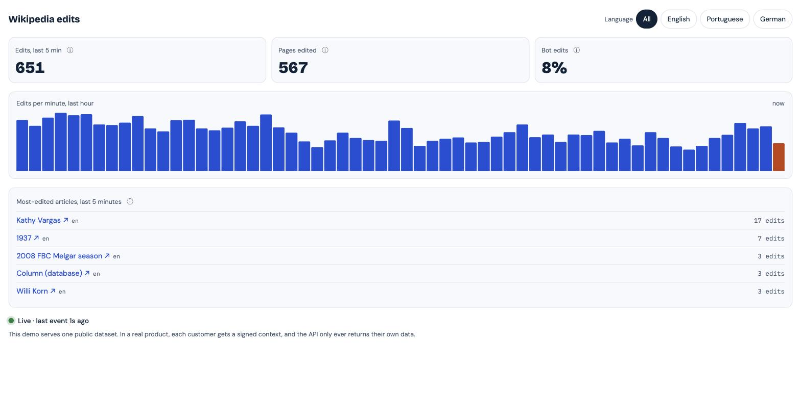
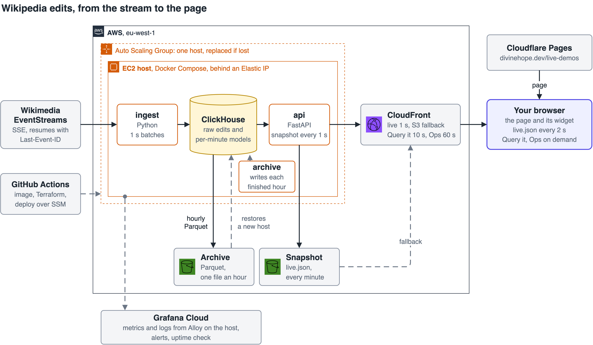

# Live data demos

[](https://github.com/Divine-Hope/portfolio-live-demos/actions/workflows/ci.yml)

Small data products I run in public. Each one takes a public event stream, stores and models it, and serves it to a widget you can embed in any page, the way analytics ships inside a product.

First up: what's being edited on English, Portuguese and German Wikipedia, right now.



*The widget on production data, 8 October 2026, 22:40 UTC.*

- **See it live:** [divinehope.dev/live-demos](https://divinehope.dev/live-demos/), the widget inside a demo host app, with "Query it" (ask the database a question) and the Ops tab (lag, freshness SLO, cost).
- **Or call the API:** [`/v1/wikipedia/live.json`](https://d1ij81u3v32tos.cloudfront.net/v1/wikipedia/live.json). A [Postman collection](docs/postman/livedemos.postman_collection.json) covers every public endpoint.
- **Running in AWS since 5 October 2026**, from one small host that replaces itself if it's lost.

## What's interesting in here

- **Kill ingest mid-insert and nothing is lost or counted twice.** [`make proof`](tests/integration/test_resume_proof.py) SIGKILLs it while an insert is running, restarts it, and checks every event against the source. How, and the limits: [ADR 0006](docs/adr/0006-bookmark-stored-with-rows.md).
- **Query costs measured at full size.** Every API query runs against 7 days of synthetic data at twice the live rate, under the API user's limits, on a laptop ([benchmarks](docs/benchmarks.md)).
- **Database work doesn't grow with viewers.** One snapshot a second, cached for a second at the edge. Measured on CloudFront: 1,000 simulated viewers (as many as one laptop could drive) sent the API one request a second ([architecture](docs/architecture.md#the-core-idea-compute-once-let-the-cdn-fan-out)).
- **It's honest when it's stale.** If the stream stops, the widget says "Paused" and the numbers freeze. Missing minutes show as gaps, not zeros ([tests](tests/e2e/test_widget.py)).
- **One host, but it heals itself.** No broker, no semantic layer, no lakehouse format, each with a written reason ([decisions](docs/adr/README.md)). A lost host is replaced and restores itself from the Parquet archive with no manual steps: live again 7 min 26 s after the host was terminated, in a drill on 10 October 2026 ([ADR 0010](docs/adr/0010-spot-host-in-an-auto-scaling-group.md)).

## Architecture

<picture>
  <source media="(prefers-color-scheme: dark)" srcset="docs/img/architecture-dark.drawio.png">
  
</picture>

Both images embed their draw.io source: open either one in [app.diagrams.net](https://app.diagrams.net) to edit it.

Details, failure modes and cost: [docs/architecture.md](docs/architecture.md). Requirements and how each is tested: [docs/requirements.md](docs/requirements.md).

Running it: the [runbook](docs/runbook.md), the [alert fire drill](docs/runbook.md#fire-drill), and the one [postmortem](docs/postmortems/2026-10-06-clickhouse-memory-drift.md) so far.

## Run it locally

You need Docker and `make`. [uv](https://docs.astral.sh/uv/) too for the tests, `make bench` and `make e2e`.

```bash
cp .env.example .env     # then set INGEST_CONTACT to your email or repo URL
make up                  # real Wikimedia stream
```

Then open http://localhost:8080.

No internet, or don't want to hit Wikimedia? `make up-offline` runs the same stack against a fake stream that speaks the same protocol.

`make help` lists everything else. The useful ones:

| Command | What it does |
|---|---|
| `make smoke` | Checks the running stack answers |
| `make logs` | Follows ingest and api logs |
| `make test` | Unit tests, no services needed |
| `make test-integration` | Integration tests against ClickHouse |
| `make proof` | The resume proof on its own |
| `make bench` | Every query against 7 days of data, in a separate database |
| `make migrate` | Applies pending schema migrations (the stack does it on start) |
| `make reconcile` | Checks the per-minute rollup against raw rows; `REPAIR=1` stops ingest and rebuilds what differs |
| `make e2e` | Browser tests for the widget, against the running stack (Chromium by default; CI also runs Firefox and WebKit) |
| `make clean` | Stops everything and deletes the data |

## Endpoints

| Route | What it returns |
|---|---|
| `/v1/wikipedia/live.json` | Everything the widget shows. Rebuilt every second. |
| `/v1/wikipedia/activity?lang=en,pt&window=1h` | An ad hoc query with ClickHouse's own timing. `window` is `5m`, `1h`, `24h`, `3d` or `7d`. |
| `/v1/ops.json` | How the pipeline is doing: ingest lag, bookmark, reconnects, 30-day freshness SLO, gaps, month-to-date AWS cost |
| `/embed/wikipedia/?lang=all&theme=dark` | The embeddable widget |
| `/healthz`, `/readyz`, `/metrics` | Liveness, readiness and Prometheus metrics (`/metrics` isn't public in production) |

## Query the archive

Every hour of edits lands in S3 as Parquet, `wikipedia/edits/dt=YYYY-MM-DD/hour=HH.parquet`. Production's bucket is private; this is how I read it, and the same query works on your own copy. With DuckDB and AWS credentials that can read the bucket:

```sql
INSTALL httpfs; LOAD httpfs;
CREATE SECRET (TYPE s3, PROVIDER credential_chain, REGION 'eu-west-1');

SELECT dt, lang, count(*) AS edits, round(avg(is_bot::int), 3) AS bot_share
FROM read_parquet('s3://<archive-bucket>/wikipedia/edits/dt=*/hour=*.parquet',
                  hive_partitioning = true)
WHERE dt >= '2026-10-01'
GROUP BY dt, lang ORDER BY dt, lang;
```

Locally the archive is in SeaweedFS: use `CREATE SECRET (TYPE s3, KEY_ID 'any', SECRET 'any', ENDPOINT 'localhost:8333', URL_STYLE 'path', USE_SSL false)` and `s3://archive/...`.

## Repo layout

```
src/livedemos/
  ingest/         stream consumer: parse, batch, resume
  api/            snapshot loop, Query it, the Ops tab, health
  db/             ClickHouse client and the versioned schema (migrations/)
  rollup/         the per-minute rollup: lock, reconcile, rebuild, restore, page sets
  archive/        hourly Parquet archive on S3
  ops/            the Ops tab's report, freshness SLO and AWS cost
devtools/         fake EventStreams server, and the benchmark (not in the package)
clickhouse/       low-memory server config, least-privilege users
web/              embeddable widget and a local demo host page
infra/            Terraform: network, host group, CloudFront, buckets, CI and deploy roles
deploy/host/      what runs on the host: render secrets, start, deploy, harden
deploy/alloy/     metrics and logs to Grafana Cloud
deploy/grafana/   the dashboard and alert rules, as code
deploy/ci/        plan summaries for pull requests
deploy/nginx/     local stand-in for the CDN
tests/            unit, integration (including the resume proof) and browser tests
docs/             architecture, requirements, decisions, benchmarks, runbook, postmortems
```

## Stack

Python 3.12, asyncio, httpx, FastAPI. ClickHouse 26.8 LTS. Plain HTML, CSS and JavaScript for the widget. Docker Compose locally. AWS (EC2, S3, CloudFront, SSM) and Terraform for production, Grafana Cloud for monitoring.

## What I'd do next

- **A second dataset**, Bitcoin from mempool.space, on the same platform. It tests whether the platform is general or just shaped around Wikipedia.
- **Keep the Ops history across a host rebuild.** The freshness samples and reconnects live on the host's disk; archiving them like the edits would make the 30-day SLO survive a replacement.
- **TLS from CloudFront to the host.** Today that hop is plain HTTP, guarded by a secret header and CloudFront-only firewall rules ([why](docs/architecture.md#security)).
- **A month of production numbers.** Freshness over 30 days, "Query it" latency on the host, merges through a TTL drop, and the first full AWS bill, in place of the laptop benchmarks and price-list estimates.
- **Signed embeds.** The language filter isn't tenant isolation. A real product would sign each customer's context and enforce it in the API.

## License

MIT
