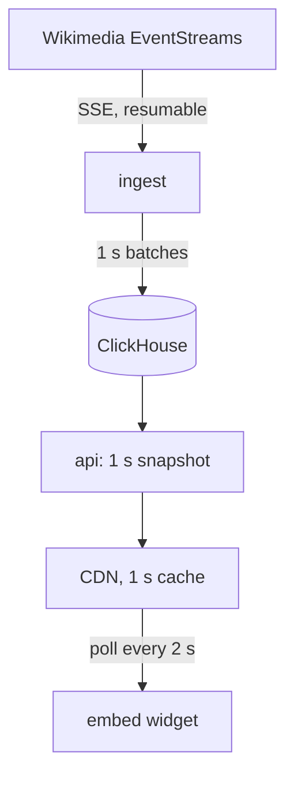

# Live data demos

[](https://github.com/Divine-Hope/portfolio-live-demos/actions/workflows/ci.yml)

Small data products I run in public. Each one takes a public event stream, stores and models it, and serves it to a widget you can embed in any page, the way analytics ships inside a product.

First up: what's being edited on English, Portuguese and German Wikipedia, right now.

> Status: running in AWS. The API is live at [`/v1/wikipedia/live.json`](https://d1ij81u3v32tos.cloudfront.net/v1/wikipedia/live.json); a [Postman collection](docs/postman/livedemos.postman_collection.json) covers every public endpoint. The page that shows it comes with the site.

## What's interesting in here

- **Ingest doesn't lose or double an edit, and the limits are written down.** The resume bookmark is stored on the rows it describes, so data and cursor can't drift apart. A failed insert is retried unchanged, with the same deduplication token, so a copy that lands late is dropped. The proof test SIGKILLs ingest while an insert is running on the server, restarts it at once, and checks every event, minute and language against the source's ground truth. The per-minute rollup isn't written in the same transaction as the raw rows, so `make reconcile` checks it against them and can rebuild it. What that covers, and what it doesn't, is in [ADR 0006](docs/adr/0006-bookmark-stored-with-rows.md).
- **Measured at full size.** The snapshot, "Query it" and resume queries run against 7 days of data at twice the live rate, with the API user's limits ([benchmarks](docs/benchmarks.md)).
- **Cost doesn't grow with viewers.** The API computes one snapshot a second. A one-second edge cache hands the same bytes to everyone ([ADR 0002](docs/adr/0002-poll-a-cached-snapshot.md)).
- **It's honest when it's stale.** Windows are anchored to the newest event. If the stream stops, the widget says "Paused" and the numbers freeze. Missing minutes show as gaps, not zeros.
- **It's small on purpose.** One host, no broker, no semantic layer, no lakehouse table format. Each "no" has a written reason and a trigger for revisiting it ([decisions](docs/adr/README.md)).

## Architecture



Details, failure modes and cost: [docs/architecture.md](docs/architecture.md). Requirements and how each is tested: [docs/requirements.md](docs/requirements.md).

## Run it locally

You need Docker and `make`. [uv](https://docs.astral.sh/uv/) too if you want to run the tests.

```bash
cp .env.example .env     # then set INGEST_CONTACT to your email or repo URL
make up                  # real Wikimedia stream
open http://localhost:8080
```

No internet, or don't want to hit Wikimedia? `make up-offline` runs the same stack against a fake stream that speaks the same protocol.

`make help` lists everything else. The useful ones:

| Command | What it does |
|---|---|
| `make smoke` | Checks the running stack answers |
| `make logs` | Follows ingest and api logs |
| `make test` | Unit tests, no services needed |
| `make test-integration` | Integration tests against ClickHouse |
| `make proof` | The resume proof on its own |
| `make bench` | Every query against 7 days of data, in a separate database |
| `make migrate` | Applies pending schema migrations (the stack does it on start) |
| `make reconcile` | Checks the per-minute rollup against raw rows; `REPAIR=1` stops ingest and rebuilds what differs |
| `make e2e` | Browser tests for the widget, against the running stack (Chromium by default; CI also runs Firefox and WebKit) |
| `make clean` | Stops everything and deletes the data |

## Endpoints

| Route | What it returns |
|---|---|
| `/v1/wikipedia/live.json` | Everything the widget shows. Rebuilt every second. |
| `/v1/wikipedia/activity?lang=en,pt&window=1h` | An ad hoc query with ClickHouse's own timing. `window` is `5m`, `1h` or `24h`. |
| `/embed/wikipedia/?lang=all&theme=dark` | The embeddable widget |
| `/readyz`, `/metrics` | Readiness and Prometheus metrics |

## Repo layout

```
src/livedemos/
  ingest/         stream consumer: parse, batch, resume
  api/            snapshot loop, Query it, health
  devtools/       fake EventStreams server, and the benchmark
  migrations/     versioned ClickHouse schema, applied once each by `migrate`
  reconcile.py    rollup-versus-raw check and repair
clickhouse/       low-memory server config, least-privilege users
web/              embeddable widget and a local demo host page
deploy/nginx/     local stand-in for the CDN
tests/            unit and integration tests, including the resume proof
docs/             architecture, requirements, decisions, benchmarks, runbook
```

## Stack

Python 3.12, asyncio, httpx, FastAPI. ClickHouse 25.8. Plain HTML, CSS and JavaScript for the widget. Docker Compose locally. AWS (EC2, S3, CloudFront, SSM) and Terraform for production, Grafana Cloud for monitoring.

## License

MIT
