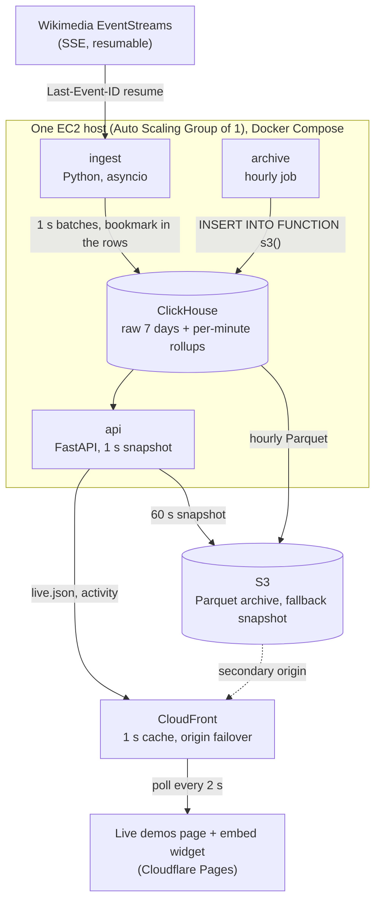

# Architecture

Status: v1, running in AWS since 2026-10-05, with Grafana Cloud monitoring and alerts. What's next is in the build order at the end.

## What this is

A public "live demos" page for my portfolio. Each demo is a small, real data product: a public event stream comes in, gets stored and modelled, and is served to a widget that embeds in any page the way analytics ships inside a product.

The first dataset is Wikipedia edits (English, Portuguese, German) from Wikimedia's EventStreams. Bitcoin mempool data from mempool.space is second.

Goals, in order:

1. **Reliable.** It runs unattended in public. Crashes, restarts and network drops must not lose or double data.
2. **Simple.** One host, few moving parts, nothing provisioned "for later".
3. **Cheap.** About $5 a month in 2026 (see [Cost](#cost)).
4. **Readable.** Someone reviewing the repo should be able to follow the data path end to end in one sitting.

## Words used here

- **Bookmark:** the stream position ingest resumes from. Wikimedia sends one with every event; we store it on the row ([ADR 0006](adr/0006-bookmark-stored-with-rows.md)).
- **Seam:** where a resumed stream overlaps what was already stored. Events there are matched by id, so none is lost or counted twice.
- **Rollup:** edits per minute per language (`wiki_edits_per_minute`), kept 90 days, written by a materialized view as raw rows arrive.
- **Page sets:** the exact set of pages edited in each minute (`wiki_pages_per_minute`), so "pages edited" over days doesn't need millions of raw rows.
- **Query it:** the page's panel that runs a real, allowlisted query and shows ClickHouse's own timing.
- **Drill:** breaking something on purpose in production to prove an alert or a recovery works.

## The core idea: compute once, let the CDN fan out

Live dashboards get expensive in two ways: a database query per viewer, and managed streaming services that bill by the hour whether anyone's watching. This design avoids both.

The API builds one snapshot per second and holds it in memory. Every viewer gets those same bytes, cached for one second at the edge. One viewer or five hundred, ClickHouse does the same work. Viewers only add bandwidth.

**Measured locally, 2026-10-04.** Simulated viewers polled `live.json` every 2 s through the nginx cache in `deploy/nginx/` for 60 s:

| Viewers | Edge requests | Served from cache | Reached the API |
|---|---|---|---|
| 100 | 2,996 | 99% | 31 (0.5 a second) |
| 1,000 | 21,628 | 99.9% | 31 (0.5 a second) |

The API's load stayed flat while viewers grew tenfold. It took one fix to get there: nginx's cache lock only covers new entries, so at each expiry every request in flight went to the API (0.6 a second at 100 viewers, 0.9 at 1,000). `proxy_cache_use_stale updating` lets one request refresh while the rest get the copy being replaced. nginx expires entries on whole seconds, so locally a copy lives 1 to 2 s.

**Measured on CloudFront, 2026-10-05.** Same test against the production distribution, from one laptop (so every request landed on one edge location, Lisbon). Origin requests are the API's own `api_requests_total` for `live.json`, read on the host before and after:

| Viewers | Edge requests | Served from cache | Reached the API |
|---|---|---|---|
| 100 | 2,868 | 97.9% | 61 (1.0 a second) |
| 1,000 | 5,667 | 98.7% | 71 (1.0 a second) |

CloudFront sends one request a second to the API whatever the viewer count: one miss per 1 s TTL. The 1,000 row is capped by the laptop, which managed 5,667 requests rather than the 30,000 that 1,000 real viewers would make; the origin count is the point. Viewers spread over many edge locations add up to one origin request a second per busy edge location, still flat in viewers.

## Diagram

What runs in AWS today: the same containers under Docker Compose on one EC2 host (an Auto Scaling Group of one, so a lost host replaces itself), behind CloudFront, with the S3 snapshot as the fallback origin and the hourly Parquet archive. Locally, nginx stands in for CloudFront and serves the widget, and SeaweedFS stands in for S3. In production the page and widget are on Cloudflare Pages, from the site's own repo.

## Components

### ingest (`src/livedemos/ingest/`)

Consumes `recentchange` from Wikimedia EventStreams over Server-Sent Events.

- **Keeps** edits and new pages on `enwiki`, `ptwiki` and `dewiki`. Drops canary (test) events, other wikis and other change types. Every outcome is counted in metrics.
- **Batches** rows and flushes every second, or at 5,000 rows while catching up. One batch is one ClickHouse INSERT. A batch never spans two UTC days, because an INSERT is only atomic within one partition.
- **Resumes** from a bookmark stored on every row ([ADR 0006](adr/0006-bookmark-stored-with-rows.md)). The bookmark only moves after an insert commits. On restart: newest row's SSE id goes back as `Last-Event-ID`.
- **Dedupes the seam.** Wikimedia resumes by timestamp, so a few events at the cut can arrive twice. The ids of the last 20,000 events ingested are checked before insert. Ingest order, not event time, because the real stream delivers late and interleaved events (checked 2026-10-04).
- **Retries safely.** Each batch carries an insert deduplication token built from its event ids, so retrying the same batch is a no-op in ClickHouse and in the rollup.
- **Retries a failed insert unchanged.** An insert can commit, or still be running, and report failure. That batch is sealed and resent with the same token and query id until ClickHouse confirms it, so a late copy is dropped. On start, ingest waits for inserts a killed predecessor left running before reading the bookmark.
- **Parses defensively.** Every field is type-checked; valid JSON of the wrong shape is counted as malformed and skipped, never raised. Parsing happens in the reader task, so only kept rows wait in the bounded queue.
- **Ignores events from the future.** Anything dated more than 5 minutes ahead is skipped, so one bad timestamp can't pin every window.
- **Backpressure by disconnecting.** If ClickHouse is down, ingest closes the stream and waits. Wikimedia keeps the events; nothing piles up in memory.
- **Idle watchdog.** `recentchange` never goes quiet. 30 seconds of silence means a half-open socket, so it reconnects.
- **First boot** subscribes with `?since=` one hour back, so charts are full from minute one. A bookmark older than the source's retention, at start or before any reconnect, records a gap from the start of its minute instead of pretending.
- **After a restore from the archive** (a host rebuilt from scratch): the newest raw rows have no bookmark. It replays from 30 minutes before the newest archived event and skips the restored ids, so anything the old host ingested after its last archive run comes back, and nothing is counted twice. Events older than the restored raw rows are dropped: their minutes were rebuilt into the rollup.
- **No raw rows, but the rollup has minutes** (an outage outlived raw retention): replays what the source still has after the rollup's last minute, and records a gap from that minute, which may be partial.

### ClickHouse (`src/livedemos/migrations/`, `clickhouse/`)

The serving store ([ADR 0003](adr/0003-clickhouse-serving-store.md)). Tuned for a 2 GB host: 900 MiB server memory cap, small caches, fewer background threads. Of the system log tables only `query_log` and `part_log` stay, for 3 days, and the application users log only slow queries (over 100 ms for `api`, 500 ms for `ingest`).

Versioned migrations, applied once each by a one-shot `migrate` job ([ADR 0009](adr/0009-versioned-migrations-separate-user.md)). Four users with least privilege: `migrator` (schema, and rollup repairs and rebuilds), `ingest` (reads what resume needs, writes raw edits, gaps and reconnects; the per-minute tables fill only through their views), `api` (reads only the tables it serves, 3 s query limit, 200 MB memory limit) and `archiver` (reads raw rows, writes the archive and the daily cost). Passwords come from the environment.

The per-minute rollup is fed by a materialized view in the same INSERT, but not the same transaction. `make reconcile` checks it against raw rows per minute and language and rebuilds what differs.

### api (`src/livedemos/api/`)

| Route | What it does |
|---|---|
| `GET /v1/wikipedia/live.json` | The widget's data. Rebuilt every second from a handful of small queries, served from memory. `Cache-Control: max-age=1`. 503 when there's no snapshot yet or it's more than 10 s old, which also triggers CDN failover. |
| `GET /v1/wikipedia/activity?lang=&window=` | "Query it": an ad hoc query with allowlisted parameters, returning ClickHouse's own `elapsed_ms` and `rows_read`. Cached 10 s in process and at the edge. See "Query it" below. |
| `GET /v1/ops.json` | The Ops tab: ingest lag, the resume bookmark, reconnects, the freshness SLO, recorded gaps and month-to-date AWS cost. Built at most once a minute and shared by every viewer; the edge caches it for what's left of that minute. See "Ops numbers" below. |
| `GET /healthz`, `/readyz` | Liveness, and readiness (fresh snapshot and ClickHouse reachable). |
| `GET /metrics` | Prometheus. |

#### Query it

- **Windows.** `5m`, `1h` and `24h` count raw rows. `3d` and `7d` read per-minute tables instead: edits from the rollup, and distinct pages by merging each minute's exact set of pages edited (`wiki_pages_per_minute`, migration 0004). That's about 10,000 rows a language a week instead of millions, and it's complete after a host rebuild, which restores only 2 days of raw rows.
- **Load shedding.** Concurrent misses for one key share one query. At most 2 queries run and 4 are admitted at once. Nobody waits more than 5 s, and a failure is remembered for 5 s. Past any of those, the answer is a 503 with `Retry-After`.

Every window is anchored to the newest event, not the wall clock, and bounded above by it; the chart takes completed minutes from the rollup and the current minute from raw rows, so it's bounded too. If ingest stalls, numbers freeze at the last thing we saw and the widget says "Paused". Nothing decays to a fake zero. The snapshot's queries run concurrently, so a late event inserted between them can show in one and not another; the next snapshot agrees again.

The payload carries `stale_after_s`, so the API and the widget can't disagree about when data is stale. Its shapes are typed in `api/contract.py`.

#### Ops numbers

Every number on the Ops tab comes from ClickHouse at request time, none from copy.

- **Freshness SLO** (requirement N2). ClickHouse samples the newest event's age once a minute by itself, with a refreshable materialized view (`freshness_samples`, migration 0005), so a sample doesn't depend on ingest or the API. A minute is fresh if every sample in it was under 60 s, stale if not, and unmeasured if it has no sample (ClickHouse down, host being replaced). Unmeasured minutes count against the SLO. The window is the last 30 days of whole minutes, starting no earlier than the first whole minute measured; `full_window` says whether it covers all 30 days. The maths is `ops/slo.py`, tested in `tests/unit/test_slo.py`.
- **Ingest lag** covers every row stored in the last hour, replays of old events included: after an outage, that's when lag matters. A minmax index on `ingested_at` keeps it from reading the week.
- **Reconnects.** Ingest records each one in `ingest_reconnects`, from a task of its own with a 2 s timeout, so a slow write never holds up a batch. Rows are sealed with a token and retried unchanged, so a write that landed but timed out isn't counted twice. While ClickHouse is down they wait in memory; if ingest restarts before ClickHouse is back, those are lost.
- **Cost.** The archive service, which runs only on the host holding the Elastic IP, calls Cost Explorer's `GetCostAndUsage` once per UTC day for the month so far, filtered by the `project=livedemos` tag. "Once" has to survive crashes, a replacement host and two hosts overlapping, so before asking it claims the day with a conditional write to the archive bucket (`ops/cost/YYYY-MM-DD.json`, `If-None-Match: *`): only one caller can create it. The winner asks and writes the answer into the same object; anyone else, or a new host later that day, copies it from there. A claim with no answer means no new figure that day, never a second call; so does a claim that spans midnight UTC. An answer that couldn't be saved is kept in memory and saved on later runs. Only this month's figure is served, with the date fetched and the currency AWS reports. The host role allows that one Cost Explorer action, and reads and writes under `ops/cost/` only.
- **Lost on a host rebuild.** The samples and reconnects live on the host's disk and aren't archived, so a rebuilt host starts them again, and `full_window` goes back to false until 30 days have passed.

### Widget (`web/embed/wikipedia/`)

A static page with no framework and no build step. It polls `live.json` every 2 seconds ([ADR 0002](adr/0002-poll-a-cached-snapshot.md)), renders the metrics, a 60-minute bar chart and the most-edited articles, and shows freshness.

- `?lang=all|en|pt|de` and `?theme=light|dark` in the URL. The host page can switch theme live with `postMessage`.
- Freshness is measured against the server's clock: the response's `Date` header plus `Age`, minus the payload's `as_of`, then counted on locally. A cached or fallback copy shows its real age. No reliance on the viewer's clock.
- Article links are built in the widget from an allowlisted language and the title, never taken from the payload. The `?api=` override only works on localhost.
- Minutes with no data render as an empty slot, not a zero.
- Definitions sit behind one keyboard-accessible "What these numbers mean" button.
- Phone first: the numbers stay side by side and the pills on one row down to 320 px, and every control is at least 44 px tall. Each article row is one link.
- It reports its height to the host page with `postMessage` (`livedemos:height`), so a host can size the iframe to fit at any width instead of guessing.
- The article list updates in place, keyed by article. Keyboard focus and a screen reader's place in the list survive every poll.
- Screen readers hear status changes (live, paused, unreachable), not the age ticking every second.

`web/index.html` is a local stand-in for the live demos page: the widget inside the "Northwind" demo host app, plus a working "Query it" panel.

### archive (`src/livedemos/archive/`)

Every finished hour of raw edits becomes one Parquet file, `wikipedia/edits/dt=YYYY-MM-DD/hour=HH.parquet`, in the archive bucket ([ADR 0004](adr/0004-parquet-archive-not-iceberg.md)). ClickHouse writes it with one `INSERT INTO FUNCTION s3(...)`, signed by the instance role, so the archive service holds no AWS credentials. It's its own small service, not part of the API: archiving needs a ClickHouse user that can write to S3, and the API is public and read-only.

- **Every hour complete, for as long as raw rows exist.** Each file is read back after writing, and `archive_hours` records how many rows it holds. Every 5 minutes, for every whole hour of the last 7 days that ingest has passed by 5 minutes, it compares ClickHouse's count with the file's and writes the hour again if ClickHouse has more: a late event, a replay after an outage, or a write that didn't match. "Passed" means the newest committed event, not the clock, so an hour waits for a replay. "Whole" means it started after the first raw row and after the retention cutoff: raw rows expire part by part, so the hour the cutoff falls in may be missing its start.
- **Never fewer rows.** A scheduled write goes ahead only if ClickHouse has more rows than the file, checked again just before writing. A host rebuilt from scratch has thinner raw data and an empty `archive_hours`: it finds its predecessor's files, checks each one's events fall inside its hour, records what they hold, and leaves them. A file it can't read is reported, not overwritten. Rewriting an hour regardless is a manual `--hour`.
- **One writer.** In production the service archives only while its host holds the Elastic IP, so while the Auto Scaling Group overlaps two hosts only the live one writes ([ADR 0010](adr/0010-spot-host-in-an-auto-scaling-group.md)). Before replacing a file it also reads the file itself, not only its own record of it.
- **Recoverable.** The bucket keeps replaced versions for 30 days, so a bad rewrite can be undone. The host can put, get and list under `wikipedia/`, never delete.
- **Rebuilds the rollup without risking it.** `python -m livedemos.archive.rebuild` needs a file for every hour in the range, or `--allow-missing` to rebuild the hours that have one and leave the rest as they are. It counts the files into a staging table a day at a time and checks every file produced as many rows as `archive_hours` recorded for it. Then, with ingest stopped, it adds the rest of each affected month and swaps whole months into the live rollup with `REPLACE PARTITION`: each month is all old or all new, never empty. It holds the same lock as migrations and reconcile repairs, so none of them overlap.
- **Completes the page sets.** `wiki_pages_per_minute` is filled by its view on every insert, and every hour is completed once it's final: from raw rows when the hour is archived, and from Parquet on `migrate` for any archived hour of the last 14 days not yet recorded as filled (`wiki_pages_filled`; a rebuilt host's older days). Rollup rebuilds and reconcile repairs top them up too. Sets only add, so none of this can count a page twice; a correction that removes a page isn't supported, and raw rows are never corrected that way.
- **Restores itself.** After migrating, `migrate` checks for raw rows. With none (a host rebuilt from scratch), before ingest starts, it puts the newest two archived days back into the raw table (the rollup fills through its view, and the archive service finds rows matching its files) and rebuilds older days, up to 90 days back, straight into the rollup. If that stopped part way (an insert over many files isn't atomic), the next run finds raw rows that don't match the files and does the raw days again. With rows ingest wrote itself, it does nothing.
- **Least privilege.** `archiver` can read `wiki_edits`, write `archive_hours`, and read and write S3 only at archive-bucket URLs (`livedemos-archive-*`); any other URL is refused, so it can't copy data elsewhere. `migrator` can read the archive, not write it. The pattern can't name the exact bucket: its name holds the account id, which stays out of this public repo. The S3 permissions themselves belong to the instance role, which every container on the host can reach; isolating that per container would cost more than this project's budget.

### alloy (`deploy/alloy/`, production only)

Grafana Alloy ships metrics and logs to Grafana Cloud's free tier ([ADR 0008](adr/0008-grafana-cloud-observability.md)). Once a minute it scrapes ingest, the API, the archive service, ClickHouse's Prometheus endpoint (a short allowlist of its 3,000 series), the host (`node_*`: memory, swap, OOM kills, disk, CPU) and memory per container (cAdvisor, labelled by compose service). It tails this project's container logs (not its own) from the Docker socket; the app's JSON `level` becomes a label. The socket is root-equivalent, so the image is pinned by digest and trusted like the host; it doesn't get the host's `/` or Docker's container configs (they hold passwords), only `/proc`, `/sys` and Docker's image metadata. It's capped at 200 MB and goes first if the host runs out of memory. Labels stay bounded: services, routes, outcomes, never titles or IPs. The dashboard is code: `deploy/grafana/build_dashboard.py` writes `livedemos.json`.

## Data model

| Table | Engine | Grain | Retention |
|---|---|---|---|
| `wiki_edits` | MergeTree, partitioned by day, ordered by `(lang, event_time)` | one row per kept edit, with `sse_id` and `ingest_seq` | 7 days |
| `wiki_edits_per_minute` | SummingMergeTree, fed by a materialized view | minute x language | 90 days |
| `ingest_gaps` | MergeTree | one row per known gap | 90 days |
| `freshness_samples` | MergeTree, fed by a refreshable view every minute | one row per minute: the newest event's age | 90 days |
| `ingest_reconnects` | MergeTree | one row per stream reconnect, with its reason | 90 days |
| `aws_cost` | MergeTree | one row per daily Cost Explorer attempt | 90 days |
| `wiki_pages_per_minute` | AggregatingMergeTree, fed by a materialized view | minute x language: the exact set of pages edited (`uniqExact` state) | 14 days |
| `wiki_pages_filled` | ReplacingMergeTree | archived hours whose page sets were completed | 14 days |

History beyond 7 days lives as hourly Parquet on S3 (see archive above). Files move to cheaper storage classes after 30 and 180 days.

## Freshness budget

| Step | Design target |
|---|---|
| Wikimedia to ingest | whatever Wikimedia's stream adds (measured, shown as ingest lag) |
| ingest batch flush | up to 1 s |
| API snapshot tick | up to 1 s |
| CDN cache | up to 1 s |
| widget poll | up to 2 s |
| **Edit on Wikipedia to pixels** | **under 5 s, target** |

These are targets. The page shows measured values (`last_event_age_s`, `ingest_lag_ms` p50 and p95), never these numbers.

## Failure modes

| What fails | What happens | How we know |
|---|---|---|
| ingest process crashes or is killed | Restarts; waits for its in-flight insert; resumes from the last committed bookmark; seam deduped. Proven by `make proof`, which kills it mid-insert. | `ingest_connected`, `time() - ingest_last_commit_timestamp_seconds` |
| Wikimedia drops the connection | Reconnect with jittered backoff from the bookmark | `ingest_reconnects_total{reason}` |
| Half-open socket | Idle watchdog reconnects after 30 s | `reason="idle"` |
| ClickHouse down | ingest disconnects and waits; after 10 s the api answers 503, so CloudFront serves the S3 copy and the widget shows "Paused" | `reason="clickhouse"`, readiness |
| Insert reports failure but committed, or commits later | The sealed batch is retried with the same token; ClickHouse keeps one copy | `test_an_insert_that_commits_but_reports_failure_is_not_written_twice`, `test_an_insert_that_lands_after_its_retry_is_not_written_twice` |
| A malformed event, or one ClickHouse would reject (namespace outside Int32, huge title) | Counted as `malformed`, skipped; ingest carries on | `ingest_events_total{outcome="malformed"}` |
| Rollup drifts from raw | `make reconcile` finds it per minute and language; `REPAIR=1` stops ingest and rebuilds | reconcile exit code |
| An older build deployed over a newer schema | `migrate` refuses; ingest and the API don't start on it | deploy fails |
| Bookmark older than retention (at start or before a reconnect) | Start fresh, record a gap; chart shows it | `ingest_gaps_recorded_total` |
| api down or warming up | CloudFront serves the last S3 snapshot, marked `status: "fallback"`; widget shows "Paused" with the real age. Drilled 2026-10-05: S3 within 1 s of `docker compose stop api`, back on the API within 8 s of start | synthetic check on `live.json` |
| Whole host lost (a Spot reclaim, a failed health check, hardware) | The Auto Scaling Group launches a replacement; `migrate` restores raw rows and the rollup from Parquet, ingest replays the outage from the stream, and the new host takes the Elastic IP once it's live. No manual steps | launch and termination emails, no-data alert |

## Security

- ClickHouse is never exposed publicly. Locally it binds to 127.0.0.1.
- The public API is read-only, uses a read-only database user whose limits are enforced by ClickHouse settings constraints (a client can tighten them, never raise them), and only accepts allowlisted parameters. Queries are bound server-side; nothing is string-formatted into SQL from user input.
- In production the origin only accepts traffic from CloudFront's managed prefix list plus a secret header. No SSH: shell access goes through SSM.
- The hop from CloudFront to the host is plain HTTP, so the secret header isn't encrypted on the way. The host has no domain of its own to get a certificate for, and the data is public and read-only; the firewall and the header stop anyone else's traffic reaching the API. TLS to the origin is on the list of next steps.
- The language selector is a filter, not tenant isolation. Real multi-tenant embedding would need a signed security context enforced by the backend. That's a later milestone.

## Local and production, side by side

| Concern | Local (`compose.yaml`) | Production |
|---|---|---|
| Edge cache and fan-out | nginx `web` container, 1 s micro-cache, cache lock | CloudFront, 1 s cache, request collapsing |
| Static site and widget | nginx serves `web/` | Cloudflare Pages |
| Fallback when api is down | none | CloudFront origin group, S3 `live.json` |
| Parquet archive | SeaweedFS `s3` container, unsigned | S3 archive bucket, instance role |
| Source | real stream, or `fake-stream` offline | real stream |
| Secrets | `.env` | SSM Parameter Store |
| Logs and metrics | `docker compose logs`, `/metrics` | Grafana Alloy to Grafana Cloud |

## Cost

| Item | Monthly |
|---|---|
| EC2: one host in an Auto Scaling Group | free until 31 Dec 2026 (on-demand t4g.small, free trial); then Spot, $6.06 to $11.17 by type |
| EBS 16 GB gp3 ($0.088/GB) + public IPv4 ($0.005/h) | $1.41 + $3.65 |
| CloudFront, Grafana Cloud, Cloudflare Pages | free tiers |
| S3: fallback snapshot and Parquet archive | about 1 cent at first, about 7 cents after a year (below) |

About $5 a month until the end of 2026, then $11.12 to $16.23 on Spot, against $18.50 on
demand. Prices are eu-west-1, from the AWS Pricing API and Spot price history on
2026-10-07; the reasoning is [ADR 0010](adr/0010-spot-host-in-an-auto-scaling-group.md).
The real bill goes in the README once there is one. Month-to-date cost, as Cost Explorer reports it for the `project=livedemos` tag, is on the Ops tab (`/v1/ops.json`).

**The archive, estimated 2026-10-06, a lower bound.** Production kept 9,302 edits an hour over the previous 24 hours. Its first 30 archive files held 270,562 edits in 13.3 MB: 49 bytes an edit with zstd. That's about 0.46 MB an hour, 11 MB a day, 0.33 GB a month, in 730 files. eu-west-1 list prices from the AWS Pricing API:

| Item | Price | A month, once a year is stored |
|---|---|---|
| Newest month, S3 Standard | $0.023 per GB-month | 0.33 GB, $0.008 |
| Months 2 to 6, Standard-IA | $0.0125 per GB-month | 1.7 GB, $0.021 |
| Months 7 to 12, Glacier Instant Retrieval | $0.004 per GB-month | 2.0 GB, $0.008 |
| Writes (730) and listings (about 730) | $0.005 per 1,000 | $0.007 |
| Read-backs (about 2,200) | $0.004 per 10,000 | under $0.001 |
| Lifecycle moves to IA and to Glacier IR | $0.01 and $0.02 per 1,000 | $0.022 |

About 7 cents a month after a year, growing under a cent a month after that. Rewrites for late events add a PUT and keep the replaced version for 30 days; even if every hour were rewritten once, that's under 2 cents more a month. Files are about 450 KB, above Standard-IA's 128 KB minimum, and they stay in each class longer than its minimum (30 and 90 days). Rebuilding a month of rollups reads 0.33 GB: under a cent in retrieval fees.

## Build order

The plan, with acceptance criteria, lives in a private tracker. Milestones, in order:

1. Foundations and docs: done.
2. Local pipeline: done; ingesting the real stream in production since 2026-10-05.
3. Local widget: done; edge cache measured; browser tests (keyboard, screen reader, axe) in CI.
4. AWS foundation: done 2026-10-05. Terraform with an approved apply on merge, keyless deploys, CloudFront with S3 failover.
5. Observability and hardening: done. Grafana Cloud metrics, logs and alerts, fire drills, the Parquet archive, a host that replaces and restores itself.
6. A measured week on the real instance: memory, freshness and the real bill. The sizing decision came early ([ADR 0010](adr/0010-spot-host-in-an-auto-scaling-group.md)); query costs at full volume are measured on a laptop ([benchmarks](benchmarks.md)).
7. Launch on the site, with the Ops tab.
8. Second dataset: Bitcoin.
