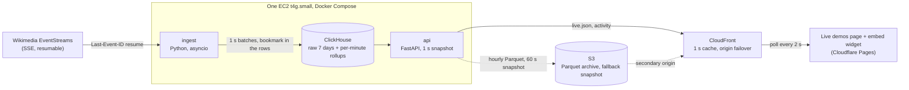

# Architecture

Status: v1, local stack built and tested. AWS deployment is next (see the build order at the end).

## What this is

A public "live demos" page for my portfolio. Each demo is a small, real data product: a public event stream comes in, gets stored and modelled, and is served to a widget that embeds in any page the way analytics ships inside a product.

The first dataset is Wikipedia edits (English, Portuguese, German) from Wikimedia's EventStreams. Bitcoin mempool data from mempool.space is second.

Goals, in order:

1. **Reliable.** It runs unattended in public. Crashes, restarts and network drops must not lose or double data.
2. **Simple.** One host, few moving parts, nothing provisioned "for later".
3. **Cheap.** About $6 a month in 2026 (see [Cost](#cost)).
4. **Readable.** Someone reviewing the repo should be able to follow the data path end to end in one sitting.

## The core idea: compute once, let the CDN fan out

Live dashboards get expensive in two ways: a database query per viewer, and managed streaming services that bill by the hour whether anyone's watching. This design avoids both.

The API builds one snapshot per second and holds it in memory. Every viewer gets those same bytes, cached for one second at the edge. One viewer or five hundred, ClickHouse does the same work. Viewers only add bandwidth.

## Diagram

What runs today is the local version: the same containers under Docker Compose, with nginx standing in for CloudFront and serving the widget. The AWS pieces (EC2, S3, CloudFront) and Cloudflare Pages come in milestones M3 and M4; dashed lines are M4.

## Components

### ingest (`src/livedemos/ingest/`)

Consumes `recentchange` from Wikimedia EventStreams over Server-Sent Events.

- **Keeps** edits and new pages on `enwiki`, `ptwiki` and `dewiki`. Drops canary (test) events, other wikis and other change types. Every outcome is counted in metrics.
- **Batches** rows and flushes every second, or at 5,000 rows while catching up. One batch is one ClickHouse INSERT. A batch never spans two UTC days, because an INSERT is only atomic within one partition.
- **Resumes** from a bookmark stored on every row ([ADR 0006](adr/0006-bookmark-stored-with-rows.md)). The bookmark only moves after an insert commits. On restart: newest row's SSE id goes back as `Last-Event-ID`.
- **Dedupes the seam.** Wikimedia resumes by timestamp, so a few events at the cut can arrive twice. The ids of the last 20,000 events ingested are checked before insert. Ingest order, not event time, because the real stream delivers late and interleaved events (checked 2026-10-04).
- **Retries safely.** Each batch carries an insert deduplication token built from its event ids, so retrying the same batch is a no-op in ClickHouse and in the rollup.
- **Trusts the table, not its memory, after a database error.** An insert can commit and still report failure. Before reconnecting, ingest re-reads the bookmark from what's actually in the table.
- **Ignores events from the future.** Anything dated more than 5 minutes ahead is skipped, so one bad timestamp can't pin every window.
- **Backpressure by disconnecting.** If ClickHouse is down, ingest closes the stream and waits. Wikimedia keeps the events; nothing piles up in memory.
- **Idle watchdog.** `recentchange` never goes quiet. 30 seconds of silence means a half-open socket, so it reconnects.
- **First boot** subscribes with `?since=` one hour back, so charts are full from minute one. A bookmark older than the source's retention records a gap instead of pretending.

### ClickHouse (`src/livedemos/schema.sql`, `clickhouse/`)

The serving store ([ADR 0003](adr/0003-clickhouse-serving-store.md)). Tuned for a 2 GB host: 900 MiB server memory cap, small caches, fewer background threads, system log tables off.

Two application users with least privilege: `ingest` (write, migrations) and `api` (read-only, 3 s query limit, 200 MB memory limit). Passwords come from the environment.

### api (`src/livedemos/api/`)

| Route | What it does |
|---|---|
| `GET /v1/wikipedia/live.json` | The widget's data. Rebuilt every second from a handful of small queries, served from memory. `Cache-Control: max-age=1`. 503 when there's no snapshot yet or it's more than 10 s old, which also triggers CDN failover. |
| `GET /v1/wikipedia/activity?lang=&window=` | "Query it". An ad hoc query with allowlisted parameters, returning ClickHouse's own `elapsed_ms` and `rows_read`. Cached 10 s in process and at the edge. |
| `GET /healthz`, `/readyz` | Liveness, and readiness (fresh snapshot and ClickHouse reachable). |
| `GET /metrics` | Prometheus. |

Every window is anchored to the newest event, not the wall clock. If ingest stalls, numbers freeze at the last thing we saw and the widget says "Paused". Nothing decays to a fake zero.

### Widget (`web/embed/wikipedia/`)

A static page with no framework and no build step. It polls `live.json` every 2 seconds ([ADR 0002](adr/0002-poll-a-cached-snapshot.md)), renders the metrics, a 60-minute bar chart and the most-edited articles, and shows freshness.

- `?lang=all|en|pt|de` and `?theme=light|dark` in the URL. The host page can switch theme live with `postMessage`.
- Freshness is measured against the server's clock: the response's `Date` header plus `Age`, minus the payload's `as_of`, then counted on locally. A cached or fallback copy shows its real age. No reliance on the viewer's clock.
- Article links are built in the widget from an allowlisted language and the title, never taken from the payload. The `?api=` override only works on localhost.
- Minutes with no data render as an empty slot, not a zero.
- Definitions sit behind keyboard-accessible info buttons.
- The article list updates in place, keyed by article. Keyboard focus and a screen reader's place in the list survive every poll.
- Screen readers hear status changes (live, paused, unreachable), not the age ticking every second.

`web/index.html` is a local stand-in for the live demos page: the widget inside the "Northwind" demo host app, plus a working "Query it" panel.

## Data model

| Table | Engine | Grain | Retention |
|---|---|---|---|
| `wiki_edits` | MergeTree, partitioned by day, ordered by `(lang, event_time)` | one row per kept edit, with `sse_id` and `ingest_seq` | 7 days |
| `wiki_edits_per_minute` | SummingMergeTree, fed by a materialized view | minute x language | 90 days |
| `ingest_gaps` | MergeTree | one row per known gap | 90 days |

History beyond 7 days will live as Parquet on S3 ([ADR 0004](adr/0004-parquet-archive-not-iceberg.md)).

## Freshness budget

| Step | Design target |
|---|---|
| Wikimedia to ingest | whatever Wikimedia's stream adds (measured, shown as ingest lag) |
| ingest batch flush | up to 1 s |
| API snapshot tick | up to 1 s |
| CDN cache | up to 1 s |
| widget poll | up to 2 s |
| **Edit on Wikipedia to pixels** | **under 5 s, target** |

These are targets. The page shows measured values (`last_event_age_s`, `ingest_lag_ms` p50 and p95), never these numbers.

## Failure modes

| What fails | What happens | How we know |
|---|---|---|
| ingest process crashes or is killed | Restarts; resumes from the last committed bookmark; seam deduped. Proven by `make proof`. | `ingest_connected`, freshness alert |
| Wikimedia drops the connection | Reconnect with jittered backoff from the bookmark | `ingest_reconnects_total{reason}` |
| Half-open socket | Idle watchdog reconnects after 30 s | `reason="idle"` |
| ClickHouse down | ingest disconnects and waits; after 10 s the api answers 503, so CloudFront serves the S3 copy and the widget shows "Paused" | `reason="clickhouse"`, readiness |
| Insert reports failure but committed | ingest re-reads the committed bookmark before reconnecting; the replay skips what landed | `test_an_insert_that_commits_but_reports_failure_is_not_written_twice` |
| Bookmark older than retention | Start from now, record a gap; chart shows it | `ingest_gaps_recorded_total` |
| api down or warming up | CloudFront serves the last S3 snapshot; widget shows "Paused" (M3/M4) | synthetic check |
| Whole host lost | `terraform apply`, ingest backfills from the stream, rollups rebuild from Parquet (M4) | no-data alert |

## Security

- ClickHouse is never exposed publicly. Locally it binds to 127.0.0.1.
- The public API is read-only, uses a read-only database user whose limits are enforced by ClickHouse settings constraints (a client can tighten them, never raise them), and only accepts allowlisted parameters. Queries are bound server-side; nothing is string-formatted into SQL from user input.
- In production the origin only accepts traffic from CloudFront's managed prefix list plus a secret header. No SSH: shell access goes through SSM.
- The language selector is a filter, not tenant isolation. Real multi-tenant embedding would need a signed security context enforced by the backend. That's a later milestone.

## Local and production, side by side

| Concern | Local (`compose.yaml`) | Production (planned) |
|---|---|---|
| Edge cache and fan-out | nginx `web` container, 1 s micro-cache, cache lock | CloudFront, 1 s cache, request collapsing |
| Static site and widget | nginx serves `web/` | Cloudflare Pages |
| Fallback when api is down | none | CloudFront origin group, S3 `live.json` |
| Source | real stream, or `fake-stream` offline | real stream |
| Secrets | `.env` | SSM Parameter Store |
| Logs and metrics | `docker compose logs`, `/metrics` | Grafana Alloy to Grafana Cloud |

## Cost

| Item | Monthly |
|---|---|
| EC2 t4g.small | free trial until 31 Dec 2026, then about $12 |
| EBS 25 GB gp3 + public IPv4 | about $6 |
| CloudFront, Grafana Cloud, Cloudflare Pages | free tiers |
| S3 | cents |

About $6 a month until the end of 2026. The real bill goes in the README once there is one.

## Build order

The full plan, with acceptance criteria, lives in Linear (project "Live demos: real-time data platform").

- **M0** Foundations and docs: docs and tooling done; repo and CI next
- **M1** Local pipeline: built and tested, running in Docker on a Mac; check against the real stream next
- **M2** Local widget: built; edge cache measured on a Mac; browser tests (keyboard, screen reader, axe) in CI
- **M3** AWS foundation
- **M4** Observability and hardening
- **M5** Measured week and sizing decision
- **M6** Launch on the site
- **M7** Second dataset: Bitcoin
